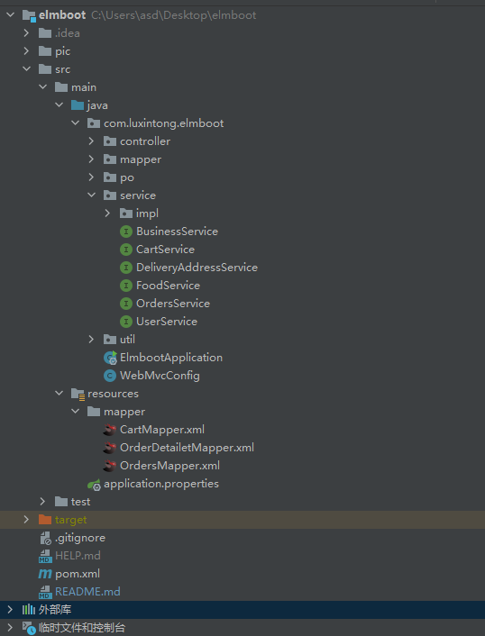

# 仿饿了么移动端官网

SpringBoot 2.7.2 构建的后端项目

# 开发环境

后端：Intellij IDEA 2019.3.5 x64 （2022.1,2023.2）+ JDK 8 + MySql 5.7（或8） + Navicat

> 项目编码为 UTF-8
>
> 用到 Maven 导入的 Jar 包：
>
> IDEA 2019（2022） 项目创建（阿里云 1.8 Jar）和结构如下：
>
> 
>
> 

## 业务流程

项目的具体流程如下图所示。

## 项目设计

### Mybatis

Mybatis 写 SQL 语句的时候可以用注解的形式，也可以写在映射文件里面。

在本工程中，我们约定

1. 简单的 SQL 语句写在注解里面
2. 复杂的 SQL 语句写在映射文件里面

映射文件放在 src/main/resources/mapper/ 里面。

> 实际上，工程编译后，main/java/com/luxintong/elmboot/mapper 和 src/main/resources/mapper 是同一个文件夹
> 这样的话，工程的映射文件和 mapper 接口会处在同一个文件夹下

### 数据库设计

#### DB一览表

| No   | 表名称          | 中文名     | 说明                               |
| ---- | --------------- | ---------- | ---------------------------------- |
| 1    | business        | 商家表     | 存储所有商家信息                   |
| 2    | food            | 食品表     | 存储每个商家所拥有的所有食品信息   |
| 3    | cart            | 购物车表   | 存储每个用户的购物车中的食品信息   |
| 4    | deliveryaddress | 送货地址表 | 存储每个用户的所有送货地址信息     |
| 5    | orders          | 订单表     | 存储每个用户的所有订单信息         |
| 6    | orderdetailet   | 订单明细表 | 存储每个订单中所订购的所有食品信息 |
| 7    | user            | 用户表     | 存储所有用户信息                   |

#### 表结构

约束类型标识：

- PK：primary key 主键
- FK：foreign key 外键
- NN：not null 非空
- UQ：unique 唯一索引
- AI：auto increment 自增长列

#### business（商家表）

| No   | 字段名          | 数据类型   | size  | 默认值 | 约束       | 说明                                                         |
| ---- | --------------- | ---------- | ----- | ------ | ---------- | ------------------------------------------------------------ |
| 1    | businessId      | int        |       |        | PK、AI、NN | 商家编号                                                     |
| 2    | businessName    | varchar    | 40    |        | NN         | 商家名称                                                     |
| 3    | businessAddress | varchar    | 50    |        |            | 商家地址                                                     |
| 4    | businessExplain | varchar    | 40    |        |            | 商家介绍                                                     |
| 5    | businessImg     | mediumtext |       |        |            | 商家图片                                                     |
| 6    | orderTypeId     | int        |       |        | NN         | 点餐分类： 1：美食、2：早餐、3：跑腿代购、4：汉堡披萨、5：甜品饮品、6：速食简餐、7：地方小吃、8：米粉面馆、9：包子粥铺、10：炸鸡炸串 |
| 7    | starPrice       | decimal    | (5,2) | 0.00   | NN         | 起送费                                                       |
| 8    | deliveryPrice   | decimal    | (5,2) | 0.00   |            | 配送费                                                       |
| 9    | remarks         | varchar    | 40    |        |            | 备注                                                         |

#### food（食品表）

| No   | 字段名      | 数据类型   | size  | 默认值 | 约束       | 说明         |
| ---- | ----------- | ---------- | ----- | ------ | ---------- | ------------ |
| 1    | foodId      | int        |       |        | PK、AI、NN | 食品编号     |
| 2    | foodName    | varchar    | 30    |        | NN         | 食品名称     |
| 3    | foodExplain | varchar    | 30    |        | NN         | 食品介绍     |
| 4    | foodImg     | mediumtext |       |        | NN         | 食品图片     |
| 5    | foodPrice   | decimal    | (5,2) |        | NN         | 食品价格     |
| 6    | businessId  | int        |       |        | FK、NN     | 所属商家编号 |
| 7    | remarks     | varchar    | 40    |        |            | 备注         |

#### cart（购物车表）

| No   | 字段名     | 数据类型 | size | 默认值 | 约束       | 说明                   |
| ---- | ---------- | -------- | ---- | ------ | ---------- | ---------------------- |
| 1    | cartId     | int      |      |        | PK、AI、NN | 无意义编号             |
| 2    | foodId     | int      |      |        | FK、NN     | 食品编号               |
| 3    | businessId | int      |      |        | FK、NN     | 所属商家编号           |
| 4    | userId     | varchar  | 20   |        | FK、NN     | 所属用户编号           |
| 5    | quantity   | int      |      |        | NN         | 同一类型食品的购买数量 |

#### deliveryaddress（送货地址表）

| No   | 字段名      | 数据类型 | size | 默认值 | 约束       | 说明         |
| ---- | ----------- | -------- | ---- | ------ | ---------- | ------------ |
| 1    | daId        | int      |      |        | PK、AI、NN | 送货地址编号 |
| 2    | contactName | varchar  | 20   |        | NN         | 联系人姓名   |
| 3    | contactSex  | int      |      |        | NN         | 联系人性别   |
| 4    | contactTel  | varchar  | 20   |        | NN         | 联系人电话   |
| 5    | address     | varchar  | 100  |        | NN         | 送货地址     |
| 6    | userId      | varchar  | 20   |        | FK、NN     | 所属用户编号 |

#### orders（订单表）

| No   | 字段名     | 数据类型 | size  | 默认值 | 约束       | 说明                              |
| ---- | ---------- | -------- | ----- | ------ | ---------- | --------------------------------- |
| 1    | orderId    | int      |       |        | PK、AI、NN | 订单编号                          |
| 2    | userId     | varchar  | 20    |        | FK、NN     | 所属用户编号                      |
| 3    | businessId | int      |       |        | FK、NN     | 所属商家编号                      |
| 4    | orderDate  | int      | 20    |        | NN         | 订购日期                          |
| 5    | orderTotal | decimal  | (7,2) | 0.00   | NN         | 订单总价                          |
| 6    | daId       | int      |       |        | FK、NN     | 所属送货地址编号                  |
| 7    | orderState | int      |       | 0      | NN         | 订单状态（0：未支付； 1：已支付） |

#### orderdetailet（订单明细表）

| No   | 字段名   | 数据类型 | size | 默认值 | 约束       | 说明         |
| ---- | -------- | -------- | ---- | ------ | ---------- | ------------ |
| 1    | odId     | int      |      |        | PK、AI、NN | 订单明细编号 |
| 2    | orderId  | int      |      |        | FK、NN     | 所属订单编号 |
| 3    | foodId   | int      |      |        | FK、NN     | 所属食品编号 |
| 4    | quantity | int      |      |        | NN         | 数量         |

#### user（用户表）

| No   | 字段名   | 数据类型   | size | 默认值 | 约束   | 说明                          |
| ---- | -------- | ---------- | ---- | ------ | ------ | ----------------------------- |
| 1    | userId   | varchar    | 20   |        | PK、NN | 用户编号                      |
| 2    | password | varchar    | 20   |        | NN     | 密码                          |
| 3    | userName | varchar    | 20   |        | NN     | 用户名称                      |
| 4    | userSex  | int        |      | 1      | NN     | 用户性别（1：男； 0：女）     |
| 5    | userImg  | mediumtext |      |        |        | 用户头像                      |
| 6    | delTag   | int        |      | 1      | NN     | 删除标记（1：正常； 0：删除） |

### UML 图

Controller 层 UML 图如下图所示。

Service 层 UML 图如下图所示。

Dao/Mapper 层 UML 图如下图所示。

## 接口设计

> 我还设计了 RESTful 风格的接口。但是未实装。
> RESTful API中，URL 中只使用名词来指定资源，原则上不使用动词。多人协作时，统一风格，可提高沟通效率。这里不再赘述，只展示一个简单的例子：
>
> 如 business 组件的接口：
>
> get+Business/OrderTypeId
>
> 参数：orderTypeId
>
> 返回值：business 数组
>
> 功能：根据点餐分类编号查询所属商家信息

### business

1. BusinessController/listBusinessByOrderTypeId
   参数：orderTypeId
   返回值：business数组
   功能：根据点餐分类编号查询所属商家信息
2. BusinessController/getBusinessById
   参数：businessId
   返回值：business对象
   功能：根据商家编号查询商家信息

### food

1. FoodController/listFoodByBusinessId
   参数：businessId
   返回值：food数组
   功能：根据商家编号查询所属食品信息

### cart

1. CartController/listCart
   参数：userId、businessId（可选）
   返回值：cart数组（多对一：所属商家信息、所属食品信息）
   功能：根据用户编号查询此用户所有购物车信息
   根据用户编号和商家编号，查询此用户购物车中某个商家的所有购物车信息
2. CartController/saveCart
   参数：userId、businessId、foodId
   返回值：int（影响的行数）
   功能：向购物车表中添加一条记录
3. CartController/updateCart
   参数：userId、businessId、foodId、quantity
   返回值：int（影响的行数）
   功能：根据用户编号、商家编号、食品编号更新数量
4. CartController/removeCart
   参数：userId、businessId、foodId（可选）
   返回值：int（影响的行数）
   功能：根据用户编号、商家编号、食品编号删除购物车表中的一条食品记录
   根据用户编号、商家编号删除购物车表中的多条条记录

### deliveryAddress

1. DeliveryAddressController/listDeliveryAddressByUserId
   参数：userId
   返回值：deliveryAddress数组
   功能：根据用户编号查询所属送货地址
2. DeliveryAddressController/getDeliveryAddressById
   参数：daId
   返回值：deliveryAddress对象
   功能：根据送货地址编号查询送货地址
3. DeliveryAddressController/saveDeliveryAddress
   参数：contactName、contactSex、contactTel、address、userId
   返回值：int（影响的行数）
   功能：向送货地址表中添加一条记录
4. DeliveryAddressController/updateDeliveryAddress
   参数：daId、contactName、contactSex、contactTel、address、userId
   返回值：int（影响的行数）
   功能：根据送货地址编号更新送货地址信息
5. DeliveryAddressController/removeDeliveryAddress
   参数：daId
   返回值：int（影响的行数）
   功能：根据送货地址编号删除一条记录

### orders

1. OrdersController/createOrders
   参数：userId、businessId、daId、orderTotal
   返回值：int（订单编号）
   功能：根据用户编号、商家编号、订单总金额、送货地址编号向订单表中添加一条记录，
   并获取自动生成的订单编号，
   然后根据用户编号、商家编号从购物车表中查询所有数据，批量添加到订单明细表中，
   然后根据用户编号、商家编号删除购物车表中的数据。
2. OrdersController/getOrdersById
   参数：orderId
   返回值：orders对象（包括多对一：商家信息；一对多：订单明细信息）
   功能：根据订单编号查询订单信息，包括所属商家信息，和此订单的所有订单明细信息
3. OrdersController/listOrdersByUserId
   参数：userId
   返回值：orders数组（包括多对一：商家信息；一对多：订单明细信息）
   功能：根据用户编号查询此用户的所有订单信息

### user

1. UserController/getUserByIdByPass
   参数：userId、password
   返回值：user对象
   功能：根据用户编号与密码查询用户信息
2. UserController/getUserById
   参数：userId
   返回值：int（返回行数）
   功能：根据用户编号查询用户表返回的行数
3. UserController/saveUser
   参数：userId、password、userName、userSex
   返回值：int（影响的行数）
   功能：向用户表中添加一条记录

> 

